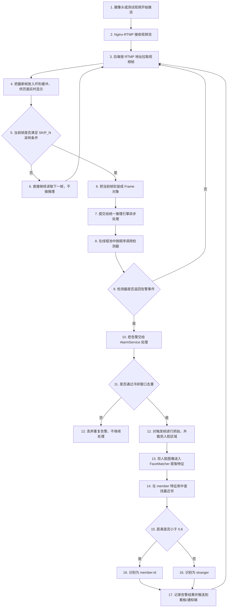
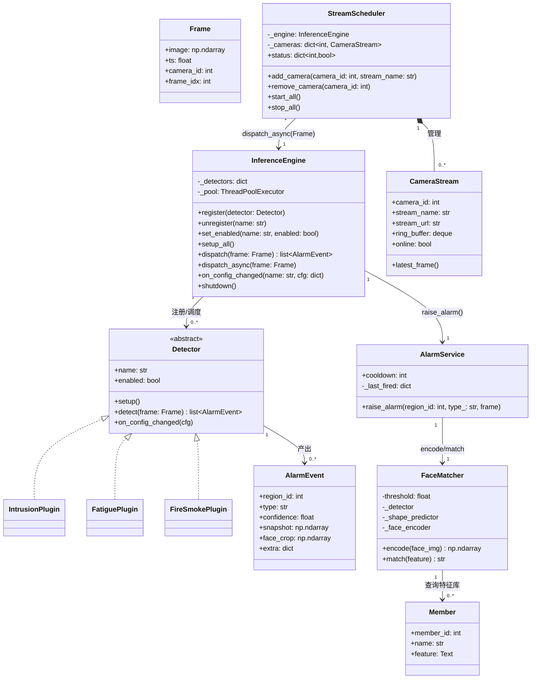
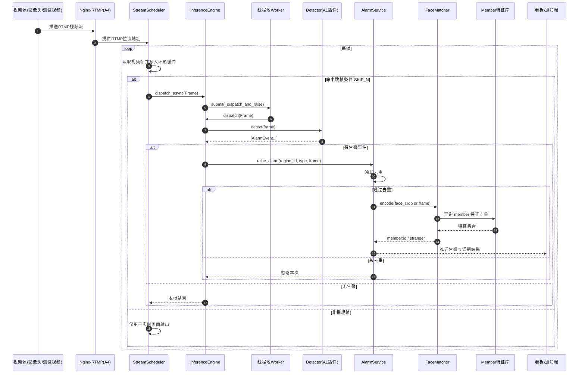

# Task A 与人脸识别功能设计说明

## 1. 功能概述

本文档面向当前仓库实现，梳理两块核心能力：

- Task A：流媒体接入、跳帧调度、统一推理引擎、告警闭环入口。
- 人脸识别：Dlib 128 维特征提取与会员库最近邻匹配，用于告警抓拍后的身份确认。

对应代码主路径：

- `backend/app/stream/scheduler.py`：拉流、环形缓冲、跳帧提交推理。
- `backend/app/stream/engine.py`：检测器注册/启停、统一线程池调度、告警透传。
- `backend/app/detectors/base.py`：`Frame`、`Detector`、`AlarmEvent` 统一接口。
- `backend/app/detectors/face.py`：`FaceMatcher.encode/match`。
- `backend/app/services/alarm.py`：告警去重、抓拍/推送闭环（当前含骨架注释）。

## 2. 功能流程图（Flowchart）

### 图说明

该图仅覆盖 Task A（A1-A4）与人脸识别能力，不展开 Task B 的入侵/疲劳业务细节。阅读时按 5 个功能点理解：

- A4 流媒体：Nginx-RTMP 接收并分发视频流（RTMP/HTTP-FLV）。
- A3 拉流调度：后端从流媒体服务拉取视频帧，维护低延迟缓冲并断流重连。
- A2 统一推理引擎：按采样帧调用已注册检测器，统一算力入口。
- A1 插件接口：所有检测器统一实现 Frame/Detector 协议。
- 人脸识别：仅在告警闭环阶段调用 FaceMatcher 识别会员/陌生人。

图介绍：

该流程图只说明系统每一步具体做什么：视频流先被接入，再被后端拉取、抽帧、检测、告警、抓拍、识别，最后把结果推送出去。每个节点都对应一次明确动作，便于直接对应代码理解。

## 3. 类图（Class Diagram）

### 图说明

该图用于说明模块职责边界。阅读顺序建议：

1. 先看数据对象：`Frame`、`AlarmEvent`。
2. 再看推理核心：`InferenceEngine` 与 `Detector` 抽象。
3. 最后看告警扩展链路：`AlarmService -> FaceMatcher -> Member`。

图介绍：

该类图用于展示模块职责与对象关系。`StreamScheduler` 负责视频帧获取与采样调度，`InferenceEngine` 负责检测器的统一注册与调用，`Detector` 通过统一接口产出 `AlarmEvent`。`AlarmService` 在告警侧负责去重与闭环触发，`FaceMatcher` 提供人脸编码与匹配能力，并面向 `Member` 特征库完成身份判定。图中的基数标识明确了一对一与一对多关系，便于理解系统扩展方式。

## 4. 时序图（Sequence Diagram）

### 图说明

该图与第 2 节保持同一口径，仅展示 Task A（A1-A4）与人脸识别闭环。关键点：

- 视频流先经过流媒体服务，再由调度器拉取并按 SKIP_N 采样。
- 统一引擎异步调度检测器，保障解码线程连续输出画面。
- 仅当有告警且通过去重时，才进入人脸特征提取与会员匹配。

图介绍：

该时序图强调运行阶段的先后约束与调用边界。视频流由流媒体服务转发给调度器后，系统按帧循环执行“读取-采样-调度”流程；采样帧通过异步方式进入统一推理引擎，避免阻塞视频读取。仅当告警事件出现且通过去重校验后，系统才进入人脸识别链路，执行特征提取、特征库匹配和结果推送。该图用于说明系统在实时性与识别准确性之间的执行策略。

## 5. 功能模块总结

Task A 与人脸识别模块共同构成了“视频处理到告警闭环”的核心主链路。

- 在接入层，系统通过 Nginx-RTMP 完成视频流接入与分发，保障前后端流链路统一。
- 在调度层，`StreamScheduler` 采用环形缓冲和 `SKIP_N` 采样策略，兼顾实时显示与计算开销。
- 在推理层，`InferenceEngine` 提供统一的检测器调用入口，避免多模型并发造成资源争抢。
- 在识别层，`FaceMatcher` 仅在有效告警后执行人脸匹配，提高识别调用的有效性。
- 在闭环层，`AlarmService` 负责告警去重与结果推送，使告警信息具备可追踪、可处置的业务价值。

整体上，该模块设计将实时视频处理、统一推理调度与身份识别能力解耦，并通过清晰的调用边界实现可扩展、可维护的工程结构。
